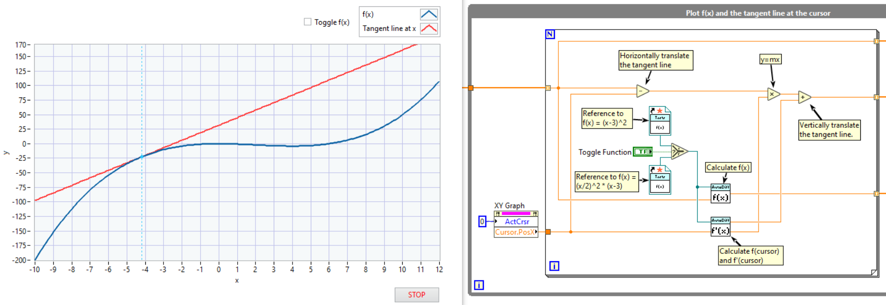

# Automatic Differentiation

This library implements forward-mode automatic differentiation in LabVIEW by introducing a new dual number type, implemented via a class, and then primitives and operations on these dual numbers in order to calculate derivatives automatically.

## Installation

This package is distributed on the VIPM Community repository for the JKI VI Package Manager.

## Usage

To use, you simply need to define your functions, using the VI templates found in the Automatic Differentiaion.lvlib library, using the dual number primitives provided. These primitives mirror those found in LabVIEW, although at this time, the less used ones are not implemented yet. They will be soon, so file an issue if you need one.

Once you have a function defined in a VI, choose what derivative you would calculate, and then wire up a _strictly typed static VI reference_ to the derivative and choose the point you would like to differentiate at. This library automatically calculates the derivative using forward-mode differentiation.

## Examples

1. Install the package using the JKI VI Package Manager
2. View examples by going to Help -> Find Examples... -> Directory Structure and then browsing to SLO Systems -> Automatic Differentiation.

## Dependencies

This library requires LabVIEW 2020 or higher. Malleable VIs are heavily used, and although they were introduced in LabVIEW 2018, LabVIEW 2019 and 2020 contain many fixes for malleable VIs.
